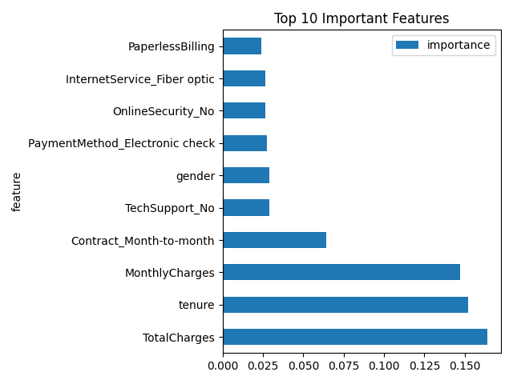
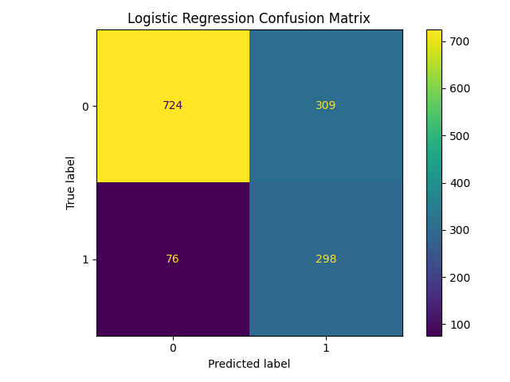
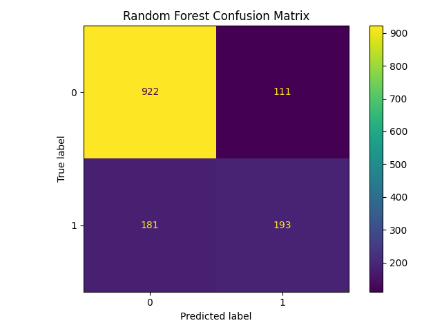
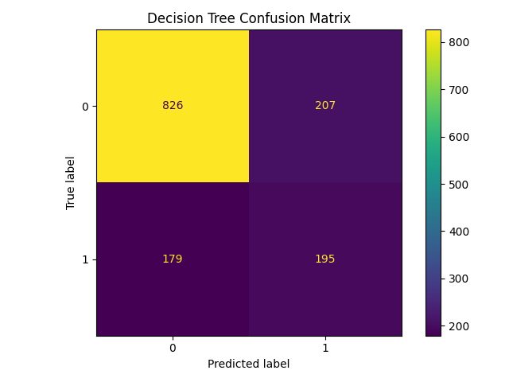

# Customer Churn Prediction using Scikit-Learn

## Overview

This project predicts customer churn using machine learning models built with Scikit-Learn.

Customer churn occurs when customers stop using a company's services. Identifying customers likely to churn allows businesses to take proactive retention measures and reduce revenue loss.

The project demonstrates a complete machine learning workflow including:

- Data Cleaning
- Exploratory Data Analysis (EDA)
- Data Preprocessing
- Feature Engineering
- Model Training
- Model Evaluation
- Model Comparison
- Feature Importance Analysis
- Model Persistence

---

## Dataset

**Dataset:** Telco Customer Churn Dataset

### Dataset Summary

| Metric | Value |
|----------|----------|
| Rows | 7,032 |
| Columns | 41 |
| Churned Customers | 1,869 (26.58%) |
| Retained Customers | 5,163 (73.42%) |

### Feature Types

#### Numerical Features
- tenure
- MonthlyCharges
- TotalCharges

#### Binary Categorical Features
- gender
- SeniorCitizen
- Partner
- Dependents
- PhoneService
- PaperlessBilling

#### Multi-Class Categorical Features
- MultipleLines
- InternetService
- OnlineSecurity
- OnlineBackup
- DeviceProtection
- TechSupport
- StreamingTV
- StreamingMovies
- Contract
- PaymentMethod

#### Target Variable
- Churn
  - 1 = Customer Left
  - 0 = Customer Stayed

---

## Project Structure

```text
Project/
│
├── README.md
├── requirements.txt
├── .gitignore
│
├── data/
│   ├── raw/
│   │   └── churn.csv
│   │
│   └── processed/
│       ├── churn_clean.csv
│       └── churn_eda.csv
│
├── model/
│   ├── model_logistic_regression.pkl
│   ├── model_random_forest.pkl
│   └── model_decision_tree.pkl
│
├── notebook/
│   └── eda.ipynb
│
├── reports/
│   ├── logistic_confusion_matrix.png
│   ├── random_forest_confusion_matrix.png
│   ├── decision_tree_confusion_matrix.png
│   └── random_forest_feature_importance.png
│
└── scripts/
    ├── preprocessing.py
    └── train.py
```

---

## Exploratory Data Analysis (EDA)

Key insights discovered during analysis:

1. Customers who churned had significantly lower tenure.
2. Customers who churned had higher monthly charges.
3. Churned customers had lower total charges, largely due to shorter tenure.
4. Female customers showed a slightly higher churn rate than male customers.
5. Senior citizens exhibited a significantly higher churn rate.
6. Month-to-month contracts had the highest churn rate.
7. Fiber optic customers churned more frequently than DSL customers.
8. Customers without tech support were substantially more likely to churn.
9. Electronic check users experienced the highest churn rate among payment methods.
10. Customers using paperless billing churned more often.
11. The dataset contains class imbalance, with only 26.58% churned customers.

---

## Data Preprocessing

### Data Cleaning

- Converted `TotalCharges` to numeric format.
- Removed rows containing invalid values.
- Dropped the `customerID` column.

### Encoding

#### Label Encoding

Applied to binary categorical variables:

- Churn
- gender
- Partner
- Dependents
- PhoneService
- PaperlessBilling

#### One-Hot Encoding

Applied to multi-class categorical variables:

- MultipleLines
- InternetService
- OnlineSecurity
- OnlineBackup
- DeviceProtection
- TechSupport
- StreamingTV
- StreamingMovies
- Contract
- PaymentMethod

### Train-Test Split

- Training Set: 80%
- Testing Set: 20%
- Stratified Sampling

### Feature Scaling

StandardScaler applied to:

- tenure
- MonthlyCharges
- TotalCharges

---

## Models Trained

### Logistic Regression

Used class balancing to address class imbalance.

### Random Forest Classifier

Ensemble model using multiple decision trees.

### Decision Tree Classifier

Single-tree baseline model used for comparison.

---

## Model Performance

### Logistic Regression

| Metric | Score |
|----------|----------|
| Accuracy | 0.73 |
| Precision | 0.49 |
| Recall | 0.80 |
| F1 Score | 0.61 |

Confusion Matrix:

```text
[[724 309]
 [ 76 298]]
```

---

### Random Forest

| Metric | Score |
|----------|----------|
| Accuracy | 0.79 |
| Precision | 0.63 |
| Recall | 0.50 |
| F1 Score | 0.56 |

Confusion Matrix:

```text
[[926 107]
 [188 186]]
```

---

### Decision Tree

| Metric | Score |
|----------|----------|
| Accuracy | 0.73 |
| Precision | 0.49 |
| Recall | 0.52 |
| F1 Score | 0.50 |

Confusion Matrix:

```text
[[826 207]
 [179 195]]
```

---

## Feature Importance Analysis

Random Forest feature importance identified the most influential features affecting churn.

### Top 10 Important Features

| Feature | Importance |
|----------|----------:|
| TotalCharges | 0.164 |
| tenure | 0.152 |
| MonthlyCharges | 0.147 |
| Contract_Month-to-month | 0.064 |
| TechSupport_No | 0.029 |
| gender | 0.029 |
| PaymentMethod_Electronic check | 0.027 |
| OnlineSecurity_No | 0.027 |
| InternetService_Fiber optic | 0.026 |
| PaperlessBilling | 0.024 |

### Interpretation

The strongest indicators of churn were:

- TotalCharges
- tenure
- MonthlyCharges
- Month-to-month contracts
- Lack of technical support

These findings align closely with the patterns observed during EDA.

---

## Visualizations

### Random Forest Feature Importance



### Logistic Regression Confusion Matrix



### Random Forest Confusion Matrix



### Decision Tree Confusion Matrix



---

## Model Selection

Although Random Forest achieved the highest overall accuracy (79%), Logistic Regression achieved substantially higher recall (80%).

For churn prediction, recall is particularly important because failing to identify a customer likely to leave can result in lost revenue and increased customer acquisition costs.

Therefore, **Logistic Regression was selected as the final model**.

---

## Installation

Clone the repository:

```bash
git clone <repository-url>
cd Project
```

Install dependencies:

```bash
pip install -r requirements.txt
```

---

## Usage

### Run Data Preprocessing

```bash
python scripts/preprocessing.py
```

Generated files:

- data/processed/churn_clean.csv
- data/processed/churn_eda.csv

### Train Models

```bash
python scripts/train.py
```

This script:

- Trains Logistic Regression
- Trains Random Forest
- Trains Decision Tree
- Evaluates model performance
- Saves trained models
- Generates feature importance analysis
- Saves confusion matrix visualizations

---

## Technologies Used

- Python
- Pandas
- NumPy
- Matplotlib
- Scikit-Learn
- Joblib
- Jupyter Notebook

---

## Future Improvements

- Hyperparameter tuning using GridSearchCV
- Threshold tuning for Logistic Regression
- ROC-AUC analysis
- Cross-validation
- Model deployment using Flask or FastAPI
- Interactive churn prediction dashboard

---

## Conclusion

This project successfully implements an end-to-end machine learning pipeline for customer churn prediction.

Three classification models were trained and evaluated:

- Logistic Regression
- Random Forest
- Decision Tree

Among the evaluated models, Logistic Regression was selected as the final model due to its superior ability to identify customers likely to churn, achieving a recall score of 0.80.

The project demonstrates practical machine learning skills including data preprocessing, exploratory data analysis, feature engineering, model evaluation, and business-oriented model selection.